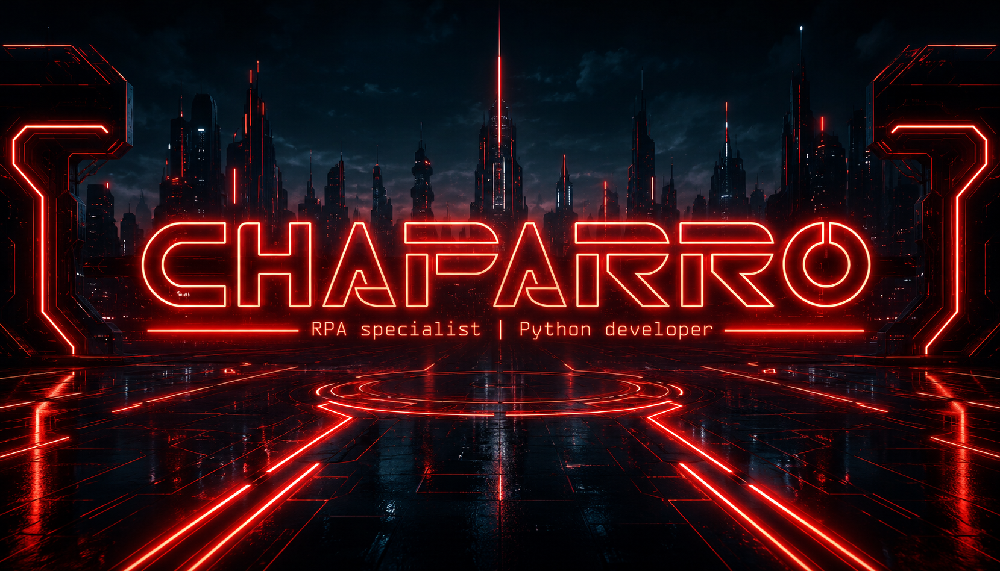

<div align="center">
  
</div>

$${\color{crimson} \space Hi \space  I'm \space Felipe \space Lopez }$$

## `> Whoami`


RPA & Automation Developer based in **Medellín, Colombia** with 3+ years building end-to-end automation systems in production environments. I combine RPA, Python scripting, and low-code platforms to eliminate manual work across finance, logistics, quality and manufacturing operations.

Currently integrating **LLM capabilities** into automation workflows to enhance intelligent document processing and decision-making pipelines.

- [**Prebel**](https://www.prebel.com/) — Automation Analyst (Jun 2022 – Present)
- [**Procaps**](https://www.procapslatam.com/) — RPA Consultant (Mar 2024 – Jul 2024)
- **Open source**: SAP GUI Scripting Library — published on [PyPI](https://pypi.org) · backing 34+ production automations

<br>

## `> Stack`

<div align="center">

| Automation & RPA | Backend & Scripting | Low-Code & Platforms |
|:---:|:---:|:---:|
|    |    |     |

| ERPs | Process & Methodology | Data & Infra |
|:---:|:---:|:---:|
|  |   |    |

</div>

<br>

## `> Projects`

<br>

**`⬡ SAP GUI Scripting Library`** &nbsp;·&nbsp; [PyPI](https://pypi.org/project/sap-gui-library/) · [GitHub](https://github.com/Chaparroo/sap-gui-library)

> Open-source Python library that abstracts the official SAP GUI Scripting API — execute transactions, extract data, and integrate with external systems without manual recordings. Adopted internally at Prebel as the foundation for **34+ production automations** used by 8 users across finance, logistics and quality teams.

```python
from sap_gui_library import SapGui,Transaction,DataProcess

sap_instance=SapGui(
    conection="our conection",
    user="user",
    password="password"
)
session=sap_instance.get_session()

cooispi=Transaction(
    session=session, 
    code="COOISPI")
cooispi.start_transaction()
...
```


## `> Stats`

<br>

<div align="center">

|  |  |
|:---:|:---:|

|  |
|:---:|

</div>

<br>

## `> Certifications --verified`

<br>

<div align="center">

| Certification | Platform | Year |
|:---|:---:|:---:|
| Business Analyst | Platzi | 2025 |
| RPA & Hyperautomation with AI | Platzi | 2025 |
| UiPath Developer | Udemy | 2025 |
| Professional Workflows with N8N | Platzi | 2025 |

</div>

<br>

## `> Connect`

<div align="center">

[](https://linkedin.com/in/lopez-chaparro)
[](https://github.com/Chaparroo)


</div>

<br>

<div align="center">

```
┌─────────────────────────────────────────────────────┐
│   CHAPARRO.SYS — LOCATION: MDQ-COL — AUTOMATING_   │
└─────────────────────────────────────────────────────┘
```

</div>